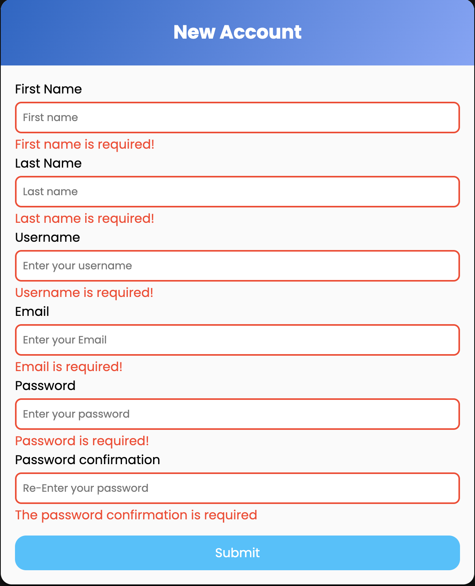
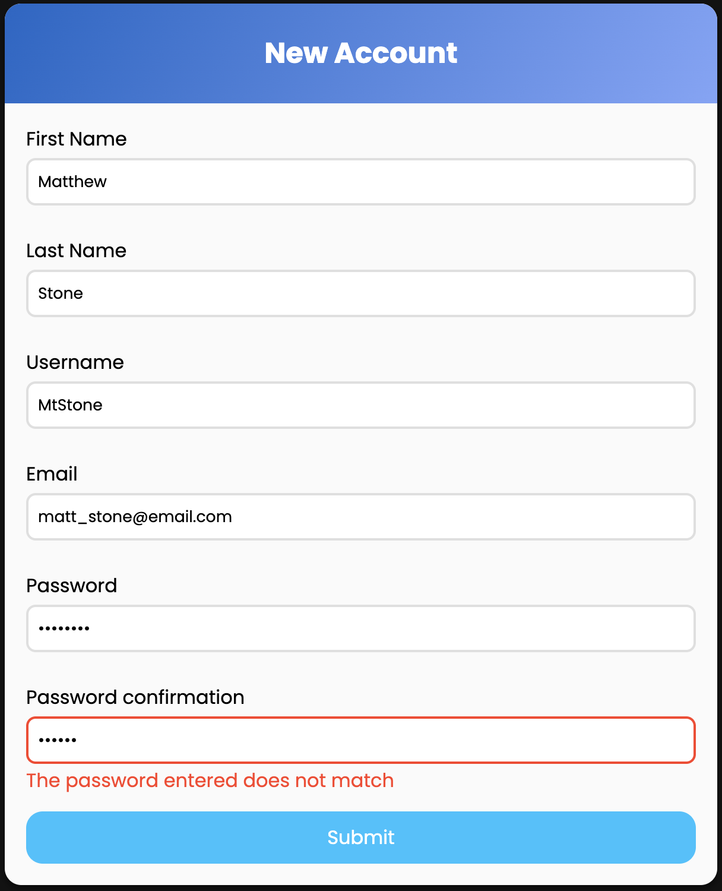

# Formulário de Cadastro / Registration form

## Índice / Index

- <a href="#Sobre">Sobre o Projeto / About the Project</a>

- <a href="Funcionalidades">Funcionalidades / Functionalities

- <a href="Tecnologias">Tecnologias utilizadas / Used Technologies </a>

- <a href="imagens">Capturas de Tela / ScreenShot</a>

- <a href="Confira">Confira o projeto / Check the project </a>

## Sobre o Projeto / About the Project

- Criação de um formulário de cadastro simples com validação dos dados inseridos pelo usuário.
O formulário tem campos de entrada simples como: Nome; Sobrenome; nome de usuário; e-mail; senha e confirmação de senha.

- Creation of a simple registration form with validation of data entered by the user.
The form has simple input fields such as: First name; Last name; user name; email; password and password confirmation.

## Funcionalidades / Functionalities

### • Validação de campo vazio / Empty field validation

- Os campos de entrada são de preenchimento obrigátorio para que o usuário efetue o cadastro com sucesso.
Se o campo ficar vazio, o mesmo é destacado com a cor vermelha e é apresentada a mensagem de erro informando o usuário de que o preenchimento do campo é necessário. Ao preencher o campo corretamente a mensagem é removida.

- The input fields are mandatory for the user to register successfully.
If the field is empty, it is highlighted in red and an error message is displayed informing the user that it is necessary to fill in the field. When filling in the field correctly the message is removed.

### • Campo e-mail e validação / Email field and validation

- Para preenchimento correto do campo de e-mail é necessário que o usuário insira um endereço de e-mail válido, se o dado informado não corresponder a um enderço de e-mail, o campo é destacado com a cor vermelha e é apresentada a mensagem de erro informando o usuário de que o dado não é válido. Ao preencher o campo corretamente a mensagem é removida.

- To correctly fill in the e-mail field, the user must enter a valid e-mail address. If the data entered does not correspond to an e-mail address, the field is highlighted in red and the message is displayed. error message informing the user that the data is not valid. When filling in the field correctly the message is removed.

### • Campo senha e validação do campo para senha / Password input field and validation

- Para o campo de senha, o usuário precisa inserir uma senha que possua a quantidade minima de 8 caracteres para que seja válida. Se o usuário deixar o campo vazio, uma mensagem de erro será apresentada solicitando que o preenchimento correto do campo. Se a senha digitada pelo usuário possuir uma quantidade de caracteres menor do que a quantidade requerida, uma mensagem de erro é apresentada. Ao preencher o campo corretamente o usuário pode prosseguir com o processo.

- For the password field, the user must enter a password that has a minimum of 8 characters for it to be valid. If the user leaves the field empty, an error message will be displayed asking the user to fill in the field correctly. If the password entered by the user has fewer characters than the required number, an error message is displayed. By filling in the field correctly, the user can continue with the process.

### • Campo confirmação de senha e Validação / Password input field and validation

- Para que não ocorra do usuário digitar a senha contendo algum tipo de erro o mesmo precisa digitara senha informada no campo senha novamente para que seja feita a confirmação da senha digitada. Caso exista alguma diferença uma mensagem de erro é apresentada para que o usuário faça a checagem e digita a senha para confirmação corretamente.

- To prevent the user from entering the password containing some type of error, they must enter the password entered in the password field again so that the entered password can be confirmed. If there is any difference, an error message is displayed so that the user can check and enter the password to confirm correctly.

## Tecnologias utilizadas / Used Technologies

- 

- 

- 

## Capturas de Tela / Screenshot

## Confira o projeto / Check the project

 <https://matsushitatomio.github.io/Form/>
